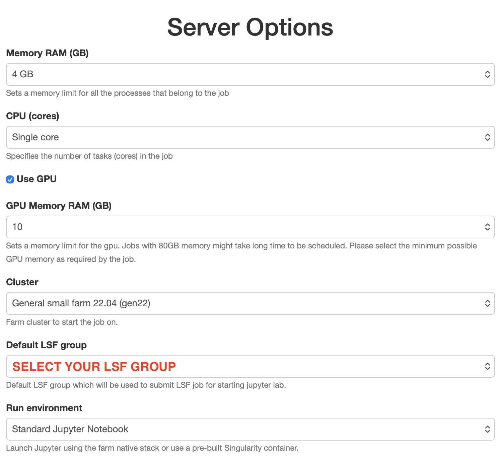
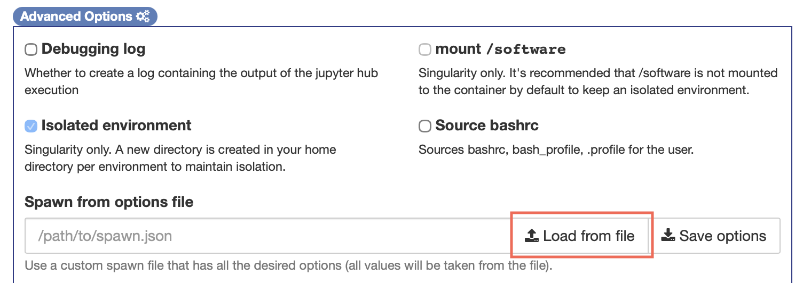
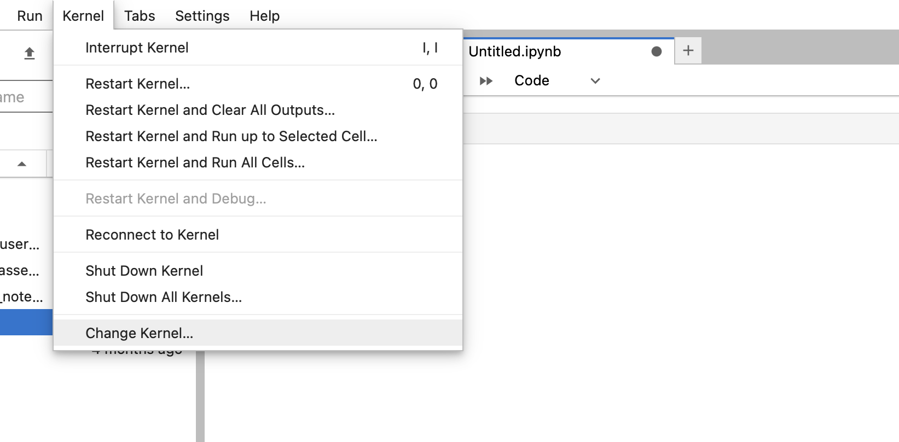

# Setting up a PyTorch Environment
These steps are for users of Sanger HPC (through the internal Jupyter servers), if you are using your own/external compute resources, the steps will likely be similar but will be applied differently. For setting up your own environment we recommend the internal documentation page: https://ssg-confluence.internal.sanger.ac.uk/spaces/FARM/pages/210700883/How+to+create+a+GPU+capable+environment

Otherwise, we have prepared an environment for you to use, which you can access in the following way.

### **Prerequisites - installl the kernel for yourself on the farm**

**You need to have completed the Sanger farm course, and have a valid LSF group.**

1. Log onto a Sanger compute farm via `ssh`, in this example we will log onto farm22: `ssh farm22`
2. Source the python virtual environment we will use for this course:
```
source /software/isg/pytorch-training/pytorch_venv/bin/activate
```
3. Install the Jupyter kernel required with the following command:
```
python3 -m ipykernel install --user --name=pytorch_env
```
This will create a file (among others) in your home directory at the location:
```
~/.local/share/jupyter/kernels/pytorch_env/kernel.json
```
This file needs editing before we can proceed, you can edit using the terminal or VSCode etc.

The file `kernel.json` needs to look as below (i.e. you change the first line of the `argv` options):
``` 
{
 "argv": [
  "/software/isg/pytorch-training/module_load.sh",
  "-m",
  "ipykernel_launcher",
  "-f",
  "{connection_file}"
 ],
 "display_name": "pytorch_env",
 "language": "python",
 "metadata": {
  "debugger": true
 }
}
```
The file can also be found in `**/software/isg/pytorch-training/kernel.json**` which should be readable by all attendees.

So if it is easier than editing the file, you can simply copy it e.g.
```
cp /software/isg/pytorch-training/kernel.json ~/.local/share/jupyter/kernels/pytorch_env/kernel.json
```

### Using the internal jupyter server
1. Navigate to a Sanger internal jupyter server
   * iI you are **on-site** please instead select one of:
     [jupyter-callisto.internal.sanger.ac.uk](https://jupyter-callisto.internal.sanger.ac.uk/)
     [jupyter-europa.internal.sanger.ac.uk](https://jupyter-europa.internal.sanger.ac.uk/) 
     [jupyter-ganymede.internal.sanger.ac.uk](https://jupyter-ganymede.internal.sanger.ac.uk/) 
     [jupyter-io.internal.sanger.ac.uk](https://jupyter-io.internal.sanger.ac.uk/) 
     [jupyter-thebe.internal.sanger.ac.uk](https://jupyter-thebe.internal.sanger.ac.uk/) 
     this is because we **do not want to** over-strain an individual Jupyter server.
   * If you are **off-site** please continue to https://jupyter.internal.sanger.ac.uk
2. Log in with your Sanger credentials.
3. When being prompted for resource selection on the main page, select the options as in the screenshot below:
   * Note: if the small farm `gen22` becomes too busy, we may need to use `farm22` in some parts.
   * You must choose a valid LSF group to access Jupyter.

5. For the **advanced options**, select ‘Load from file’ and upload the saved `kernel.json` file from earlier
or paste the path to your copy of it on the farm (this step may not be necessary)


You should then be able to open a Jupyter notebook.

### Troubleshooting
The correct kernel may not have been loaded, you can check this by seeing if running the following cell:
```
import torch
```
raises an error.

To get around this, you need to change the kernel as shown in the below screenshot


The kernel you need to select from the options is called `pytorch_env`
